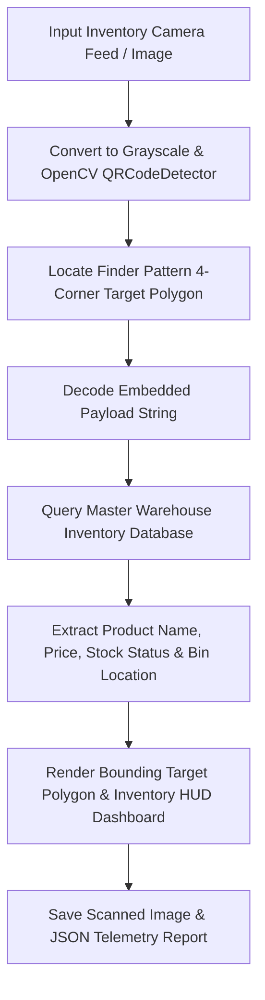

<div align="center">

# 📱 AI QR Code & Barcode Scanner & Inventory Matrix

### *Day 23 — 30-Day Computer Vision & Deep Learning Challenge*

[](https://www.python.org/)
[](https://opencv.org/)
[](https://numpy.org/)
[](LICENSE)
[](https://github.com/manasha1232)

*Real-time AI QR Code and Barcode scanner with polygon finder target localization, payload decoding, automated warehouse database auditing, and stock telemetry dashboards.*

---

</div>

## 📌 Overview

The **AI QR Code & Barcode Scanner & Inventory Matrix** system scans 2D QR codes and 1D barcodes from camera feeds or photos, fits bounding target polygons around code finder patterns, decodes embedded payload strings, queries an integrated product database, and displays real-time stock levels, pricing, category, and warehouse bin locations.

### 🎯 Key Capabilities
- **Finder Pattern & Polygon Target Localization**: Identifies code finder patterns and overlays neon bounding polygons regardless of camera rotation angle.
- **Payload String Extraction**: Decodes embedded SKU, item, and URL strings.
- **Automated Inventory Database Audit**: Queries product database (`inventory_database.json`) for price ($), stock status (`IN STOCK` vs `OUT OF STOCK`), and warehouse bin location.
- **2-Panel Inventory HUD Dashboard**: Generates side-by-side montages displaying `[Camera Input + Target Polygon]` | `[Warehouse Inventory Audit Matrix]`.
- **JSON Telemetry Log Exporter**: Exports structured JSON logs detailing payload text, product details, stock counts, and file output paths.

---

## 🏗️ System Architecture & Processing Pipeline



---

## 📁 Repository Structure

```text
ai_qr_barcode_scanner/
├── qr_barcode_scanner.py     # Core scanner engine & HUD renderer
├── generate_demo_barcodes.py # Synthetic QR code inventory image generator
├── requirements.txt          # Dependency declarations (opencv-python, numpy)
├── README.md                 # Project documentation
├── input/                    # Input inventory image dataset
│   └── sample_inventory_qr.jpg
└── output/                   # Scanned output images & JSON reports
    ├── sample_inventory_qr_scanned.jpg
    ├── sample_inventory_qr_inventory_montage.jpg
    └── sample_inventory_qr_scan_report.json
```

---

## ⚡ Quickstart & Installation

### 1. Install Dependencies
```bash
pip install -r requirements.txt
```

### 2. Generate Synthetic QR Inventory Scene
```bash
python generate_demo_barcodes.py
```

### 3. Run AI QR Code Scanner
```bash
python qr_barcode_scanner.py --input input/sample_inventory_qr.jpg --output output
```

---

## 📊 Inventory Telemetry Output Specification

```json
{
    "filename": "sample_inventory_qr.jpg",
    "decoded_payload": "ITEM-9842-MACBOOK-PRO",
    "database_match": true,
    "processing_time_sec": 0.0864,
    "product_info": {
        "name": "Apple MacBook Pro 16\" M3 Max",
        "category": "Computers & Electronics",
        "price_usd": 2499.0,
        "stock_status": "IN STOCK",
        "quantity": 14,
        "warehouse_bin": "A-12-04"
    }
}
```

---

## 👤 Author & Challenge Context

- **Challenge**: Day 23 of [30-Day Computer Vision & Deep Learning Challenge](https://github.com/manasha1232/30-Day-Computer-Vision-Challenge)
- **Author**: [@manasha1232](https://github.com/manasha1232)
- **License**: MIT License
